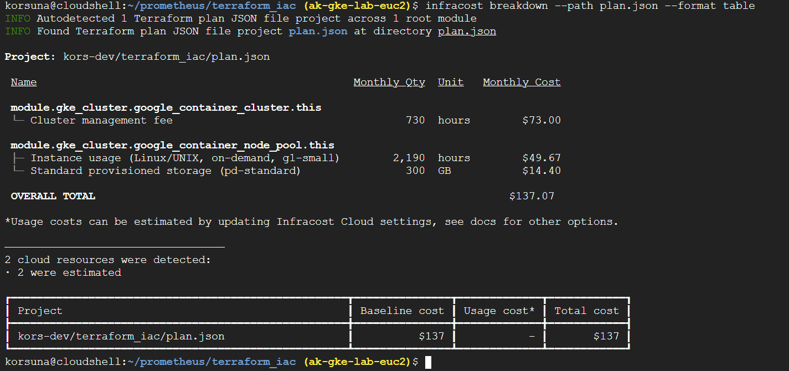
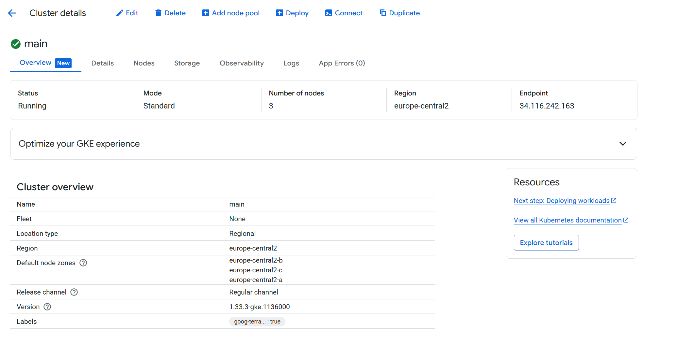

# Terraform IaC for GKE (GCP Cloud Shell Walkthrough)

This guide walks you through preparing an infrastructure repository and deploying a Google Kubernetes Engine (GKE) cluster with Terraform. It also covers cost estimation with Infracost and migrating Terraform state to Google Cloud Storage (GCS).

> **Scope:** Minimal working example for a lab/sandbox. Adjust values (machine types, node counts, regions) to your real needs.

---

## 1) Configure gcloud

Set your **project** and **region** (example region: `europe-central2` — Warsaw):

```bash
gcloud config set project ak-gke-lab-euc2
gcloud config set compute/region europe-central2
```

Enable required APIs:

```bash
gcloud services enable container.googleapis.com compute.googleapis.com
```

Verify Terraform is available:

```bash
terraform -v
```

---

## 2) Repository Files

Create a Terraform working directory (e.g., `terraform_iac/`) and add the following files.

### `main.tf`

> Replace `<YOUR-REPO>` with your GitHub repository that hosts the reusable GKE module.

```hcl
module "gke_cluster" {
  source         = "github.com/<YOUR-REPO>/tf-google-gke-cluster"
  GOOGLE_REGION  = var.GOOGLE_REGION
  GOOGLE_PROJECT = var.GOOGLE_PROJECT
  GKE_NUM_NODES  = var.GKE_NUM_NODES
}
```

### `variables.tf`

> **Important:** Use a **region** (e.g., `europe-central2`), not a zone (`us-central1-c` is a zone).

```hcl
variable "GOOGLE_PROJECT" {
  type        = string
  description = "GCP project ID"
}

variable "GOOGLE_REGION" {
  type        = string
  default     = "europe-central2" # <- use a REGION here
  description = "GCP region for GKE"
}

variable "GKE_NUM_NODES" {
  type        = number
  description = "Default number of GKE nodes"
  default     = 2
}
```

### `vars.tfvars`

```hcl
GOOGLE_REGION  = "europe-central2"
GOOGLE_PROJECT = "<YOUR_GCP_PROJECT_ID>"
GKE_NUM_NODES  = 2
```

> Tip: For **regional** clusters, 2 nodes means 2 nodes **per zone**. If you hit SSD quota issues, try `GKE_NUM_NODES = 1` or switch to a **zonal** cluster in the module.

---

## 3) Initialize, Format, Validate

```bash
terraform init
terraform fmt -recursive
terraform validate
```

---

## 4) Create a Plan and Export JSON

Generate the plan and save it to a file:
```bash
terraform plan -var-file=vars.tfvars -out=plan.out
```

Export plan to JSON (for tooling like Infracost):
```bash
terraform show -json plan.out > plan.json
```

(Optional) Pretty print the JSON in Cloud Shell:
```bash
jq '.' plan.json > tmp.json && mv tmp.json plan.json
```

---

## 5) Infracost (Install, Configure, Run)

Install Infracost:
```bash
curl -fsSL https://raw.githubusercontent.com/infracost/infracost/master/scripts/install.sh | sh
```

Configure API key:
```bash
infracost configure set api_key <YOUR_INFRACOST_API_KEY>
```

Run the breakdown:
```bash
infracost breakdown --path plan.json --format table
```

Example screenshots you can place in your repo (optional):
```

```

---

## 6) Deploy the Infrastructure

Apply the plan using your tfvars:
```bash
terraform apply -var-file=vars.tfvars
```

> **Note:** Creating a GKE cluster usually takes ~8–15 minutes for Standard clusters (regional can take longer than zonal).

---

## 7) Inspect State and Outputs

```bash
terraform show
```

Optional screenshot placeholder:
```

```

---

## 8) Destroy (Clean Up After Testing)

```bash
terraform destroy -var-file=vars.tfvars
```

> If you see an error about `deletion_protection = true`, first update the cluster resource via the module to set it to `false`, apply, then destroy. Alternatively, delete the cluster with `gcloud` and remove it from Terraform state (advanced users).

---

## 9) Migrate State to Google Cloud Storage (Remote Backend)

Create a new bucket (via Console or CLI) to store Terraform state.

Add this **backend** block at the top of your root `main.tf` (not in the module):

```hcl
terraform {
  backend "gcs" {
    bucket = "your-bucket-name"
    prefix = "terraform/state"
  }
}
```

Re-initialize to migrate state:
```bash
terraform init
```

Verify that state has been uploaded to GCS:
```bash
gsutil ls -r gs://your-bucket-name/terraform/state
```

> The local `terraform.tfstate` file is no longer needed once the migration completes successfully.

---

## 10) Git Hygiene & Secrets

- Do **not** commit `*.tfstate`, `*.tfstate.backup`, `plan.out`, or sensitive `*.tfvars` to a public repo.
- Consider committing `.terraform.lock.hcl` to lock provider versions.
- Store secrets in Secret Manager or pass via environment variables; do not hardcode credentials in `.tf` or `.tfvars`.

---

